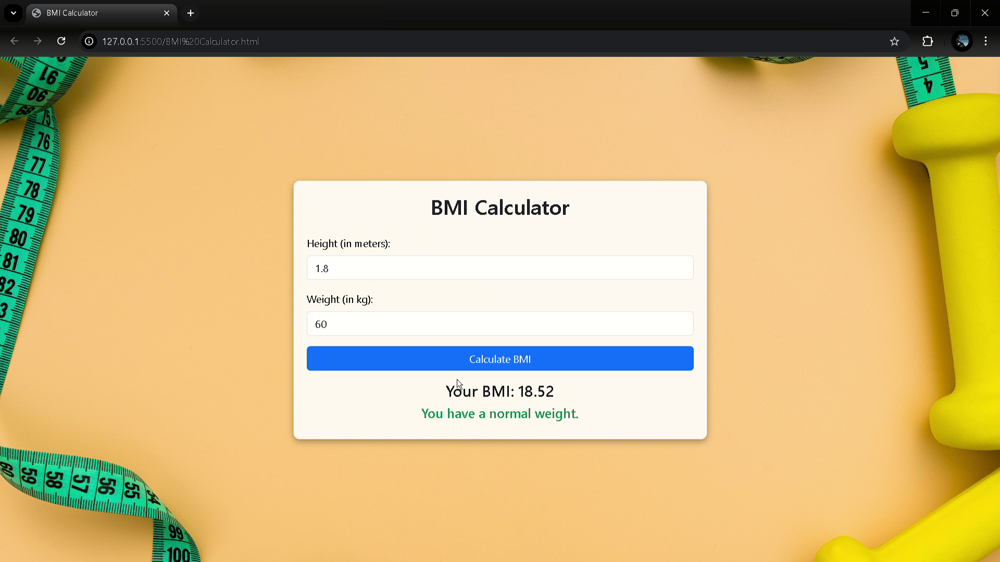

# BMI Calculator

A simple web-based Body Mass Index (BMI) Calculator using HTML, CSS (Bootstrap), and JavaScript.

## Features

- Responsive design using Bootstrap 5
- User-friendly interface
- Takes height (in meters) and weight (in kg) as input
- Calculates BMI and categorizes the result:
  - Underweight
  - Normal weight
  - Overweight
  - Obese
- Provides real-time feedback with different text colors for each BMI category
- Ensures valid height and weight parameters for calculation (Giving 0 or negative values leads to error)

## How to Use

1. Enter your height in meters.
2. Enter your weight in kilograms.
3. Click the **"Calculate BMI"** button.
4. The BMI value and corresponding category will be displayed.

## Screenshot

<h2 align="center">That is My BMI Calculator 🚀</h2>
